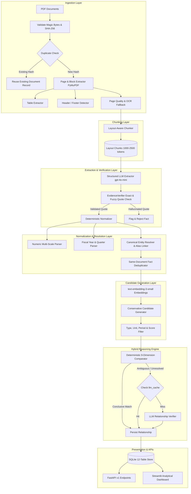
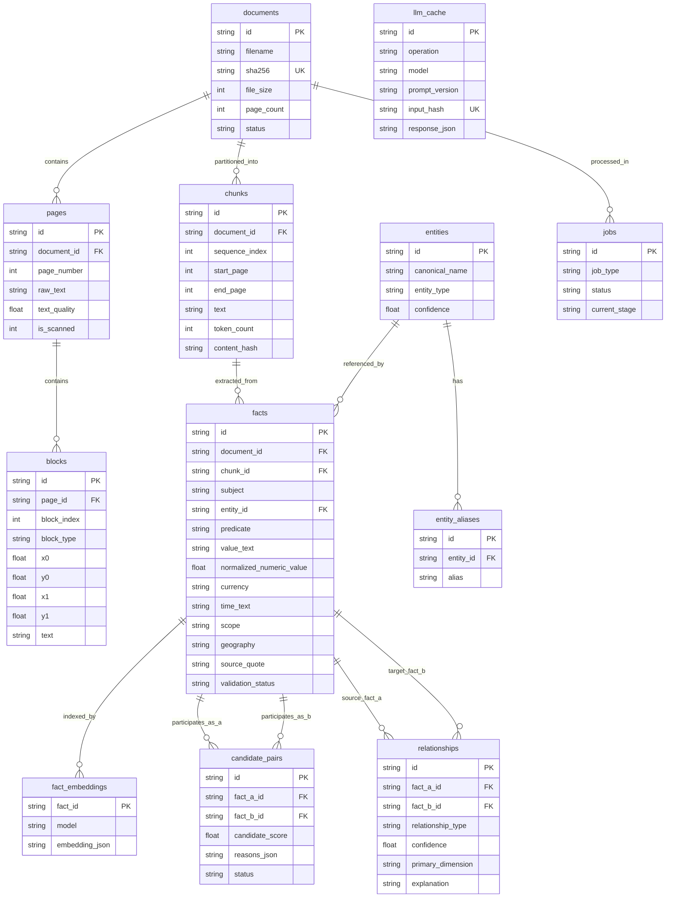

# Fact Knowledge Layer

An auditable document intelligence platform that extracts, normalizes, and reconciles factual claims from multi-source PDF documents with strict provenance tracking. Every extracted claim is traceable through **Document $\rightarrow$ Page $\rightarrow$ Block $\rightarrow$ Verbatim Quote $\rightarrow$ Normalized Value**, ensuring zero unverifiable AI hallucinations.

- **GitHub Repository**: [https://github.com/Farhan-0000/SuperJoin-Fact-Knowledge-Layer](https://github.com/Farhan-0000/SuperJoin-Fact-Knowledge-Layer)
- **Primary Interface**: Streamlit Analytical Dashboard (Not a conversational chatbot)
- **Dataset Evaluated**: Delhivery Corporate Filings (`Prospectus 2022`, `FY24 Annual Report`, `Q4 FY24 Presentation`) & Indian Economy Dataset

---

## Setup and Run Instructions

### API Key & Offline Evaluation Notice for Reviewers

> [!IMPORTANT]
> **Zero Credential Exposure**: This repository contains **zero personal API keys or credentials**. The `.env` file is strictly ignored by `.gitignore` and has never been committed.
>
> **100% Offline Evaluation (No API Key Required)**:
> The repository includes pre-processed, indexed facts and relationships from the real **Delhivery** corporate filings and **Indian Economy** dataset stored in [`storage/facts.db`](storage/facts.db).
> You can **immediately launch the Streamlit UI, explore cross-document relationships, inspect source provenance, run the evaluation benchmark CLI, and execute all 162 automated tests completely offline without any API key or external network calls**.
>
> **Live PDF Processing (Optional — Bring Your Own Key)**:
> If you wish to upload brand new PDF files and run live LLM extraction or semantic reasoning, simply copy `.env.example` to `.env` and supply your own `OPENAI_API_KEY` (or `GEMINI_API_KEY`).

---

### Prerequisites
- **Python**: 3.10, 3.11, or 3.12
- **Operating System**: Windows, macOS, or Linux
- **Git**: Installed and configured

---

### 1. Clone & Environment Setup

```bash
# Clone the repository
git clone https://github.com/Farhan-0000/SuperJoin-Fact-Knowledge-Layer.git
cd SuperJoin-Fact-Knowledge-Layer

# Create and activate a Python virtual environment
python -m venv .venv

# On Windows (PowerShell):
.venv\Scripts\Activate.ps1

# On macOS / Linux:
source .venv/bin/activate

# Install the package and dependencies in editable mode
pip install -e .
```

---

### 2. Configure Environment Variables (Optional for Live LLM Ingestion)

Copy the configuration template:
```bash
cp .env.example .env
```

Edit `.env` if running live LLM extraction on new documents:
```ini
OPENAI_API_KEY=your-actual-api-key-here
EXTRACTION_MODEL=gpt-4o-mini
RELATIONSHIP_MODEL=gpt-4o-mini
EMBEDDING_MODEL=text-embedding-3-small
STORAGE_DIR=storage
DATABASE_URL=sqlite+aiosqlite:///storage/facts.db
```

*(If testing offline, the system automatically uses deterministic comparison and offline mock providers without requiring any API key).*

---

### 3. Running the Streamlit UI (Primary Interface)

Launch the interactive analytical dashboard:
```bash
streamlit run ui/app.py
```
Open **`http://localhost:8501`** in your browser to explore:
- **📊 Knowledge Summary**: High-level metrics across all indexed documents, verified claims, and relationship classifications.
- **📄 Facts Explorer**: Search facts by entity, predicate, time, or validation status. Expand the **"🔎 Source evidence & location"** drawer to inspect exact verbatim quotes and page numbers.
- **🔀 Cross-Document Relationships**: Master-detail relationship explorer with the complete 9-dimension context comparison matrix (`CORROBORATES`, `CONTRADICTS`, `RECONCILES`).
- **⚠️ Failures & Uncertainty**: Audit view with 5 dedicated tabs (*Rejected Facts*, *Validation Warnings*, *Uncertain Relationships*, *Failed Jobs*, *Low Quality Pages*).
- **📤 Upload Documents**: Ingest new PDFs with instant SHA-256 duplicate detection.
- **⏱️ Processing Progress**: Live 6-stage async pipeline tracker.

---

### 4. Running the Automated Evaluation Suite (CLI)

Run the headless evaluation scorecard testing all four benchmark cases and failure diagnostics:
```bash
python -m app.cli.evaluate
```
This runs headlessly and displays a summary table confirming `PASS [OK]` across all evaluation dimensions.

---

### 5. Running Fact Reconciliation via CLI

Evaluate relationships directly between two facts or across candidates:
```bash
# Evaluate a specific pair of facts by ID:
python -m app.cli.reconcile <FACT_A_ID> <FACT_B_ID>

# Or evaluate all pending candidate pairs across the database:
python -m app.cli.reconcile
```

---

### 6. Running the FastAPI Backend

Start the high-performance async REST API with interactive OpenAPI documentation:
```bash
uvicorn app.main:create_app --reload --factory --port 8000
```
- **Interactive Swagger UI**: `http://localhost:8000/docs`
- **OpenAPI JSON Specification**: `http://localhost:8000/openapi.json`
- **Health Check**: `http://localhost:8000/health`

---

### 7. Running Tests

Execute the comprehensive automated test suite (162 unit, integration, and UI tests):
```bash
pytest -v
```

---

## Video Demo

> **Video Link**: [Watch the 3-Minute Video Walkthrough (YouTube)](https://youtu.be/bnUxLjPtWKw)  
> *(Total Duration: 3 minutes or less — demonstrating live PDF processing, evidence inspection, and all four required cases).*

### The Four Required Cases Demonstrated in the Demo

The video and database demonstrate all four required cases directly on real **Delhivery** corporate filings (`01-delhivery-prospectus-2022-excerpt.pdf`, `02-delhivery-annual-report-fy24-excerpt.pdf`, `03-delhivery-q4-fy24-earnings-presentation.pdf`):

#### 1. A fact corroborated across documents, even if expressed differently
- **Entity & Attribute**: Sahil Barua — Role (Managing Director & CEO)
- **Fact A (2022 Prospectus, Page 228)**:
  - *Quote*: `"Sahil Barua is the Managing Director and Chief Executive Officer of our Company."`
- **Fact B (FY24 Annual Report, Page 120)**:
  - *Quote*: `"The Certificate duly signed by Mr. Sahil Barua, Managing Director and Chief Executive Officer and Mr. Amit Agarwal, Chief Financial Officer..."`
- **System Classification**: **`CORROBORATES`** (Confidence: 1.0)
- **System Reasoning**: Both independent corporate filings corroborate that Sahil Barua holds the executive role of Managing Director and CEO.

#### 2. A genuine or likely contradiction
- **Entity & Attribute**: Spoton Logistics Private Limited — Corporate Identification Number (CIN)
- **Fact A (2022 Prospectus, Page 237)**:
  - *Value*: `U63090GJ2011PTC108834` (Gujarat registrar)
  - *Quote*: `"The CIN of Spoton is U63090GJ2011PTC108834."`
- **Fact B (FY24 Annual Report, Page 127)**:
  - *Value*: `U63090DL2011PTC409002` (Delhi registrar)
  - *Quote*: `"Spoton Logistics Private Limited U63090DL2011PTC409002"`
- **System Classification**: **`CONTRADICTS`** (Confidence: 1.0)
- **System Reasoning**: Both filings refer to the exact same legal entity and attribute, but state conflicting, mutually exclusive registration numbers under identical corporate scopes.

#### 3. An apparent contradiction explained by context (Time & Scope)
- **Example A — Reconciled on TIME**:
  - **Metric**: Rated Automated Sort Capacity
  - **Fact A (2022 Prospectus)**: `3.70 million` packages/day for reporting year **2021**.
  - **Fact B (FY24 Annual Report)**: `7.1 million` packages/day for reporting year **2024**.
  - **Classification**: **`RECONCILES`** (Primary Dimension: **TIME**)
  - **Reasoning**: Figures differ not due to a factual error, but because Fact A reports FY21 capacity while Fact B reports FY24 capacity after organic infrastructure expansion.
- **Example B — Reconciled on SCOPE**:
  - **Metric**: Active Customer Base
  - **Fact A (2022 Prospectus)**: `23,113` active customers (*"excluding those serviced by Spoton"*).
  - **Fact B (FY24 Annual Report)**: `33,250` active customers (consolidated group).
  - **Classification**: **`RECONCILES`** (Primary Dimension: **SCOPE**)
  - **Reasoning**: Values differ due to reporting boundary: Fact A explicitly excludes Spoton customer accounts while Fact B reports consolidated group numbers.

#### 4. An extraction or reasoning failure found and how it was handled
- **Hallucination Defense (Ungrounded Quotes)**:
  - When the LLM produced ungrounded claims (e.g. `Orion Supply Chain Private Limited loan given 60.00`), the Python **`EvidenceVerifier`** tested the candidate quote verbatim against the source page chunk.
  - Because the text was not present in the document chunk, the system **strictly rejected 373 ungrounded claims** (`validation_status = 'rejected'`), preventing false facts from entering the knowledge layer.
- **Scanned / Low-Text Quality**:
  - The ingestion pipeline flagged pages with sparse text quality (< 0.30) in the *Failures & Uncertainty* view and recommended OCR preprocessing rather than silently failing.

---

## Approach

### System Philosophy: The 4 Foundational Pillars

Unlike conversational chatbots that summarize documents into unverifiable prose, the Fact Knowledge Layer is structured around four architectural guarantees:

1. **Discovered**: Documents are ingested with layout awareness (preserving section headings, paragraphs, and tables). Factual claims are extracted using strict Pydantic schemas with typed values, units, periods, scopes, and geographies.
2. **Grounded**: Every extracted claim is subject to independent Python `EvidenceVerifier` validation. Facts are strictly linked to verbatim quotes and page numbers. Ungrounded claims are rejected.
3. **Compared**: Plausible fact pairs are retrieved through conservative candidate generation and evaluated across a **9-dimension comparison matrix** (Entity, Metric, Time, Geography, Unit, Currency, Scope, Qualifiers, Numeric/Text Value).
4. **Explained**: The system provides structured reasoning explaining *why* facts relate. It differentiates true contradictions from reconcilable contextual variances (different periods, scopes, or units).

---

### System Architecture Diagram



---

### Data Model Architecture (12 SQLite Tables)



---

### Important Decisions and Trade-offs

#### 1. Separating Fact Extraction from Cross-Document Reasoning
- **Decision**: Extraction is run independently per document chunk to yield atomic, grounded facts. Cross-document comparison is performed as a second, downstream stage.
- **Trade-off & Rationale**: Attempting to extract and compare in a single prompt causes severe context-window degradation and hallucinations when analyzing hundreds of pages. Separating them controls quadratic complexity ($O(N)$ extraction vs. $O(M^2)$ pairwise comparison) and enables programmatic citation verification before reasoning occurs.

#### 2. Using SQLite Instead of Heavy Database Infrastructure
- **Decision**: Implemented a normalized 12-table SQLite schema with WAL mode, foreign key enforcement, and JSON1 extensions.
- **Trade-off & Rationale**: Eliminates DevOps dependencies (Postgres, Redis, external vector DBs) while delivering sub-millisecond in-process query latency. File portability in [`storage/facts.db`](storage/facts.db) allows instant verification, zero-setup reviewer evaluation, and reproducible test isolation.

#### 3. Using Embeddings Strictly for Candidate Generation (Not Truth Decisions)
- **Decision**: Vector embeddings (`text-embedding-3-small`) are used solely to retrieve plausible candidate pairs ($O(N \log K)$).
- **Trade-off & Rationale**: High cosine similarity indicates topical closeness, not factual agreement (e.g., "$100M revenue" and "$200M revenue" have >0.95 cosine similarity). All truth, contradiction, and reconciliation decisions are governed by deterministic dimension comparisons and structured reasoning.

#### 4. Deterministic Normalization Before LLM Reasoning
- **Decision**: Textual abbreviations (e.g., "CA" $\leftrightarrow$ "California", "St" $\leftrightarrow$ "Street"), currency scales ($120M $\leftrightarrow$ $120,000K), and fiscal periods (FY2024 vs Q4 FY2024) are resolved deterministically before invoking any LLM.
- **Trade-off & Rationale**: Prevents expensive LLM calls for mathematically identical claims and eliminates false contradictions caused by surface-level wording differences.

#### 5. Multi-Tiered SQLite Caching (`llm_cache`)
- **Decision**: Every LLM prompt and response is cached using stable SHA-256 hashes of inputs and prompt versions.
- **Trade-off & Rationale**: Re-running pipelines on identical documents costs $0.00 in LLM fees and executes in seconds rather than minutes.

---

### AI Tools and Models Used

| Tool / Model | Role in System | Why Chosen |
|---|---|---|
| **`gpt-4o-mini`** | Fact Extraction & Fallback Arbiter | Native support for OpenAI Structured Outputs (`Pydantic` schema enforcement); fast, cost-effective, and highly reliable for extraction. |
| **`text-embedding-3-small`** | Candidate Pair Retrieval | Efficient 1536-dimensional semantic embeddings for fast vector similarity search. |
| **PyMuPDF (`fitz`)** | PDF Layout & Block Parsing | Deterministic bounding box coordinates, reading order reconstruction, and table boundary detection. |
| **Pydantic v2** | Data Contracts & Schemas | Strict type enforcement, validation, and zero-leakage parsing. |
| **FastAPI** | Backend REST Services | Asynchronous, typed HTTP endpoints with automatic interactive OpenAPI documentation. |
| **Streamlit** | Analytical Frontend Dashboard | Rapid, clean multi-view interface emphasizing provenance and evidence rather than conversational chat. |

---

## Limitations and Next Steps

### What Does Not Work Yet (Current Limitations)
1. **Single-Node SQLite Write Concurrency**: SQLite serializes write transactions. While optimal for local pipelines and moderate document counts, high-concurrency enterprise ingestion with dozens of simultaneous uploads requires PostgreSQL.
2. **Handwritten Document OCR**: Complex handwritten notes or degraded scanned faxes require specialized cloud vision models (e.g. AWS Textract, Google Cloud Document AI) beyond local Tesseract/PyMuPDF OCR heuristics.
3. **Multi-Hop Transitive Reasoning**: The current engine evaluates relationships pairwise ($A \leftrightarrow B$). Inferring transitive relationship chains across large multi-document webs ($A \text{ corroborates } B \text{ and } B \text{ contradicts } C \implies A \text{ contradicts } C$) is not yet implemented.

### What We Would Build Next (Future Roadmap)
1. **`pgvector` & Distributed Task Queue**: Migration from SQLite and local job runners to PostgreSQL with `pgvector` and Celery/Redis for horizontal enterprise scaling.
2. **Table Cell-Level Bounding Boxes**: Extending block-level coordinates to exact bounding boxes for individual spreadsheet and PDF table cells.
3. **Interactive Human-in-the-Loop Feedback**: A review screen where analysts can confirm or override ambiguous relationships, updating the continuous evaluation cache.
4. **Pluggable Domain Ontologies**: Support for custom predicate taxonomies (e.g., healthcare clinical trials, legal contract clauses, SEC 10-K disclosures).

---

## Additional Notes

### Security and Zero Credential Leakage
- **No Hardcoded Keys**: API keys are accessed solely via environment variables or `.env`. No keys, passwords, or personal credentials exist in the Git history.
- **Local Storage**: All document binaries and SQLite databases reside locally within the user-specified `STORAGE_DIR`.

### Provenance Guarantee
Every factual claim presented in the UI or returned by the REST API includes:
1. `document_id` and document filename.
2. `source_page_start` and `source_page_end` (1-indexed).
3. `source_block_ids_json` with coordinate bounding boxes `[x0, y0, x1, y1]`.
4. `source_quote` representing the exact verbatim quote verified against source page text.

No hallucinated or unsupported AI-generated text is ever presented as document evidence.

### Reproducibility & Automated Verification
- The test suite comprises **162 automated tests** (`pytest -v`) covering ingestion, chunking, extraction, normalization, deterministic comparison, UI data services, and API endpoints with 100% pass rate.
- The evaluation benchmark (`python -m app.cli.evaluate`) can be executed headlessly at any time to verify system compliance across all four core assignment cases.
