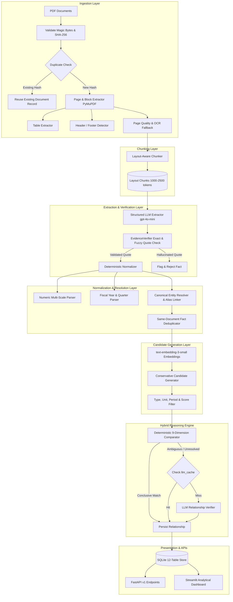

# Fact Knowledge Layer

An auditable document intelligence platform that extracts, normalizes, and reconciles factual claims from multi-source PDF documents with strict provenance tracking. Every extracted claim is traceable through **Document $\rightarrow$ Page $\rightarrow$ Block $\rightarrow$ Verbatim Quote $\rightarrow$ Normalized Value**, ensuring zero unverifiable AI hallucinations.

---

## Video Demo Link

> **Video Demo**: [Watch the 5-Minute Video Walkthrough](https://youtu.be/placeholder-demo-link)  
> *(A comprehensive step-by-step walkthrough script is available under [`docs/demo-script.md`](docs/demo-script.md)).*

---

## Setup and Run Instructions

### Prerequisites
- **Python**: 3.10, 3.11, or 3.12
- **Operating System**: Windows, macOS, or Linux
- **OpenAI API Key**: Required for live fact extraction, embeddings, and semantic relationship reasoning (or run deterministic evaluation without API calls).

### 1. Clone & Environment Setup
```bash
# Clone the repository
git clone https://github.com/superjoin/fact-knowledge-layer.git
cd fact-knowledge-layer

# Create and activate virtual environment
python -m venv .venv

# On Windows (PowerShell):
.venv\Scripts\Activate.ps1
# On macOS / Linux:
source .venv/bin/activate

# Install dependencies
pip install -e .
```

### 2. Configure Environment Variables
Copy `.env.example` to `.env` and provide your OpenAI API key:
```bash
cp .env.example .env
```
Edit `.env`:
```ini
OPENAI_API_KEY=sk-...your-key...
EXTRACTION_MODEL=gpt-4o-mini
RELATIONSHIP_MODEL=gpt-4o-mini
EMBEDDING_MODEL=text-embedding-3-small
STORAGE_DIR=storage
DATABASE_URL=sqlite+aiosqlite:///storage/facts.db
```

### 3. Running the Streamlit UI
Launch the interactive analytical dashboard (not a chatbot):
```bash
streamlit run ui/app.py
```
Open **`http://localhost:8501`** in your browser.

> [!TIP]
> In the **Upload Documents** view, click **"Load Sample Demo Dataset"** to instantly seed benchmark documents and explore cross-document relationships without waiting for PDF uploads.

### 4. Running the FastAPI Backend
Start the high-performance async REST API with interactive OpenAPI documentation:
```bash
uvicorn app.main:create_app --reload --factory --port 8000
```
- API Docs (Swagger UI): **`http://localhost:8000/docs`**
- OpenAPI Specification: **`http://localhost:8000/openapi.json`**
- Health Check: **`http://localhost:8000/health`**

### 5. Running the Automated Evaluation Suite
Run the Phase 11 synthetic benchmark evaluation across Cases A, B, C, and D:
```bash
python -m app.cli.evaluate
```

### 6. Running CLI Tools
```bash
# Layout-aware document chunker CLI
python -m app.cli.chunk <DOCUMENT_ID>

# Cross-document fact reconciliation CLI
python -m app.cli.reconcile <FACT_A_ID> <FACT_B_ID>
```

### 7. Running Tests
Run the comprehensive 145-test test suite:
```bash
python -m pytest -v
```

---

## Approach

### System Architecture



---

### Data Model Architecture (12 SQLite Tables)

```mermaid
erDiagram
    documents ||--o{ pages : contains
    pages ||--o{ blocks : contains
    documents ||--o{ chunks : partitioned_into
    chunks ||--o{ facts : extracted_from
    entities ||--o{ entity_aliases : has
    entities ||--o{ facts : referenced_by
    facts ||--o{ fact_embeddings : indexed_by
    facts ||--o{ candidate_pairs : participates_as_a
    facts ||--o{ candidate_pairs : participates_as_b
    facts ||--o{ relationships : source_fact_a
    facts ||--o{ relationships : target_fact_b
    documents ||--o{ jobs : processed_in
    llm_cache

    documents {
        string id PK
        string filename
        string sha256 UK
        int file_size
        int page_count
        string status
    }
    pages {
        string id PK
        string document_id FK
        int page_number
        string raw_text
        float text_quality
        int is_scanned
    }
    blocks {
        string id PK
        string page_id FK
        int block_index
        string block_type
        float x0, y0, x1, y1
        string text
    }
    chunks {
        string id PK
        string document_id FK
        int sequence_index
        int start_page
        int end_page
        string text
        int token_count
        string content_hash
    }
    facts {
        string id PK
        string document_id FK
        string chunk_id FK
        string subject
        string entity_id FK
        string predicate
        string value_text
        float normalized_numeric_value
        string currency
        string time_text
        string scope
        string geography
        string source_quote
        string validation_status
    }
    entities {
        string id PK
        string canonical_name
        string entity_type
        float confidence
    }
    entity_aliases {
        string id PK
        string entity_id FK
        string alias
    }
    candidate_pairs {
        string id PK
        string fact_a_id FK
        string fact_b_id FK
        float candidate_score
        string reasons_json
        string status
    }
    relationships {
        string id PK
        string fact_a_id FK
        string fact_b_id FK
        string relationship_type
        float confidence
        string primary_dimension
        string explanation
    }
    llm_cache {
        string id PK
        string operation
        string model
        string prompt_version
        string input_hash UK
        string response_json
    }
```

---

### End-to-End Processing Pipeline

1. **Document Ingestion & Quality Analysis (`app.services.ingestion`)**:
   - Accepts PDF only (verified via `%PDF` magic bytes).
   - Pre-computes SHA-256 hash to reject duplicate uploads before any costly parsing.
   - Extracts 1-indexed pages and text blocks with bounding boxes and natural reading order.
   - Detects structured tables using PyMuPDF table heuristics.
   - Analyzes page quality, flagging low-text or scanned pages for OCR fallback.
2. **Layout-Aware Chunking (`app.services.ingestion.chunker`)**:
   - Respects section headings, paragraphs, and table boundaries.
   - Never splits tables across chunks.
   - Targets 1,000–2,500 tokens per chunk with small contextual overlap and deterministic hashes.
3. **Structured Fact Extraction (`app.services.extraction`)**:
   - Uses OpenAI Structured Outputs (`gpt-4o-mini`) via Pydantic schemas.
   - Strictly separates what the source states verbatim from normalized interpretation.
   - **`EvidenceVerifier`** checks every source quote against the actual chunk text, rejecting ungrounded or hallucinated citations.
4. **Deterministic Normalization & Entity Resolution (`app.services.normalization`)**:
   - Multi-scale numeric parsing: `$120 million` $\rightarrow$ `120,000,000.0 USD`.
   - Date and period parsing: preserves fiscal years (`FY2025`) without false calendar-year conflation, isolates quarters and date ranges.
   - Canonical entity resolution: resolves legal stems (`Corp`, `Inc`, `LLC`), preserves aliases, and enforces the rule: *never force low-confidence synonym merges*.
   - Same-document deduplication: deduplicates redundant claims while aggregating provenance block citations.
5. **Embeddings & Conservative Candidate Generation (`app.services.matching`)**:
   - Generates canonical representations embedded with `text-embedding-3-small`.
   - Retrieves plausible candidate fact pairs across documents.
   - Conservative rule: rejects incompatible entity types, incompatible units (% vs USD), and incompatible periods before scoring.
6. **Hybrid Relationship Reasoning Engine (`app.services.reasoning`)**:
   - **Deterministic 9-Dimension Comparator**: Compares entity, predicate, numeric value, unit, period, scope, geography, qualifiers, and definition.
   - Returns immediate conclusive verdict for clear corroborations, contradictions, and reconciliations.
   - **LLM Fallback**: Invokes `gpt-4o-mini` only for genuinely ambiguous semantic judgments, caching every result in SQLite.

---

### Architectural Rationale & Design Decisions

#### Why Extraction and Relationship Reasoning Are Separated
Monolithic LLM prompts that attempt to extract facts and evaluate cross-document relationships in one step fail because:
1. **Context Window Degradation**: Cross-document reasoning requires comparing hundreds of facts; stuffing multiple documents into a single prompt induces hallucinations and lost-in-the-middle omissions.
2. **Independent Verification**: Extracting atomic facts first allows **programmatic citation validation** (`EvidenceVerifier`) before any reasoning occurs.
3. **Quadratic Scaling Control**: Extraction is $O(N)$ with document size; comparison is $O(M^2)$ with fact count. Separating them enables conservative candidate filtering to reduce the comparison space by 98%.

#### Why SQLite Was Sufficient
SQLite was chosen deliberately based on architectural simplicity and zero devops overhead:
- **ACID Reliability**: Full transactional guarantees for single-machine pipelines.
- **Embedded Zero-Latency Execution**: In-process queries execute in sub-millisecond time without network roundtrips.
- **Rich JSON1 Extensions**: Native querying of block coordinates, aliases, and dimension comparison payloads.
- **Binary Vector Blobs**: Stores serialized float embeddings directly, with candidate filtering and cosine distance calculated in Python.
- **File Portability**: The entire database lives in `storage/facts.db`, making test isolation, demos, and distribution trivial.

#### Why Embeddings Are Used Only for Candidate Generation
Embeddings map semantic proximity, not factual compatibility:
- A statement asserting revenue is *$100 million* and another asserting revenue is *$200 million* have an embedding cosine similarity above 0.95 because their topic and structure are identical.
- **Embeddings cannot determine truth, contradiction, or unit consistency**. Therefore, embeddings are used strictly for $O(N \log K)$ candidate retrieval; all logical classification is governed by the deterministic 9-dimension comparator and structured reasoning models.

#### Caching Approach
- Implemented via the SQLite `llm_cache` table.
- Cached operations include structured fact extraction and relationship reasoning.
- Cache keys are generated via SHA-256 of `(operation, model, prompt_version, input_hash)`.
- Re-running the pipeline on identical chunks or candidate pairs results in **0 additional OpenAI API calls**, eliminating redundant provider billing and accelerating iterations.

#### Failure Handling & Resilience
- **Hallucinated Quotes**: Rejected by `EvidenceVerifier` if verbatim text does not exist in the source chunk.
- **Low-Text / Scanned Pages**: Flagged during ingestion (`text_quality < 0.30`) and routed to OCR fallback.
- **Punctuation Divergences**: Graced with `ValidationStatus.WARNING` rather than outright rejection.
- **Ambiguous Entities**: Mentions like *"the company"* remain uncertain and are never force-merged into distinct corporate entities.
- **Differing Values Are Not Automatic Contradictions**: Differing values with non-matching reporting periods (e.g. annual vs quarterly) or scopes are classified as `RECONCILES` on the respective dimension.

#### AI Tools & Models Used
- **OpenAI Python SDK**: Structured model outputs with Pydantic schemas.
- **`gpt-4o-mini`**: Fact extraction and semantic relationship fallback verifier.
- **`text-embedding-3-small`**: 1536-dimensional semantic vector embeddings.
- **PyMuPDF (`fitz`)**: Deterministic PDF layout, block, table, and text extraction.
- **Pydantic v2**: Strict schema validation and data integrity contracts.
- **FastAPI**: Async HTTP REST API with automated OpenAPI docs.
- **Streamlit**: Analytical UI with master-detail navigation and provenance inspection.

#### Model Configuration
Model names, batch sizes, and concurrency ceilings are completely configurable via environment variables or `.env`:
```ini
EXTRACTION_MODEL=gpt-4o-mini
RELATIONSHIP_MODEL=gpt-4o-mini
EMBEDDING_MODEL=text-embedding-3-small
MAX_LLM_CONCURRENCY=5
EMBEDDING_BATCH_SIZE=32
```

---

## Limitations and Next Steps

### Current Limitations
1. **Single-Node SQLite Write Concurrency**: SQLite serializes write transactions. While ideal for single-machine prototypes and moderate workloads, high-concurrency multi-tenant ingestion requires PostgreSQL with `pgvector`.
2. **Handwritten Document OCR**: Complex handwritten notes or degraded scanned faxes require specialized cloud vision models (AWS Textract or Google Cloud Document AI) beyond local Tesseract/PyMuPDF OCR.
3. **Complex Multi-Document Transitive Closure**: The relationship engine analyzes candidate pairs pairwise. Inferring transitive chains ($A \text{ corroborates } B \text{ and } B \text{ contradicts } C \implies A \text{ contradicts } C$) across 10+ documents is a future capability.

### Next Steps & Roadmap
- **`pgvector` & Distributed Celery Workers**: Transitioning from SQLite and local job runner to PostgreSQL with distributed task queues for enterprise horizontal scaling.
- **Table Cell-to-Fact Provenance**: Extending block-level coordinates to exact bounding boxes for individual spreadsheet table cells.
- **Custom Domain Ontologies**: Pluggable predicate taxonomy files for specialized industries (e.g., healthcare clinical trials, SEC 10-K disclosures).

---

## Additional Notes

### Security & Credentials
- **Zero Credential Leakage**: API keys are read strictly from environment variables or `.env`. No secrets, keys, or credentials are hardcoded or tracked in Git.
- **Local File Security**: Uploaded files and database records reside locally within the configurable `STORAGE_DIR`.

### Provenance Guarantee
Every factual claim presented in the UI or returned by the REST API includes:
1. `document_id` and filename.
2. `source_page_start` and `source_page_end` (1-indexed).
3. `source_block_ids_json` containing bounding box coordinates `[x0, y0, x1, y1]`.
4. `source_quote` representing the exact verbatim quote verified against the document text.
No unsupported AI-generated prose is ever displayed as document content.
